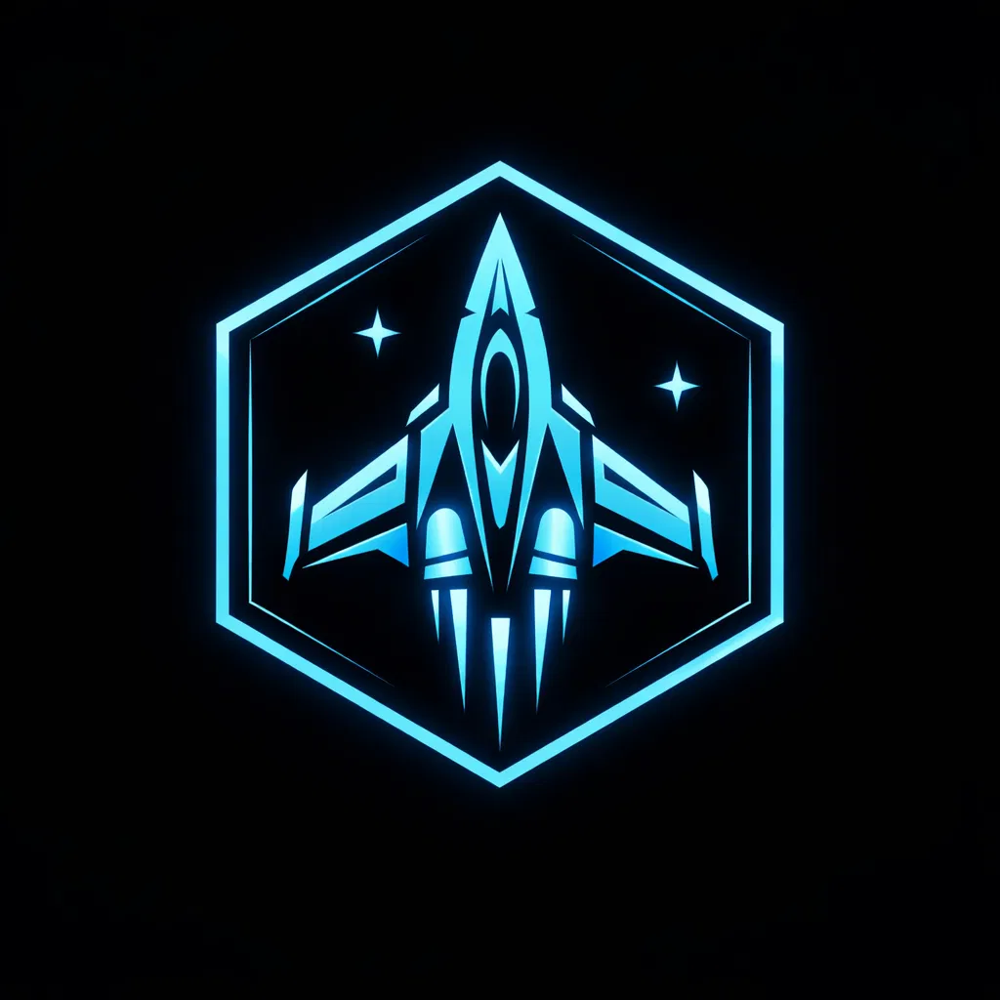

<!DOCTYPE html>
<html lang="zh-TW">
<head>
    <meta charset="UTF-8">
    <title>太空射擊：學號挑戰</title>
    
</head>
<body>
    

        <!-- 這裡已更新為你的檔案名稱 shotgame.webp -->
        
        <h1>太空射擊挑戰</h1>
        
分數: 0

    

    <canvas id="gameCanvas"></canvas>

    
</body>
</html>
